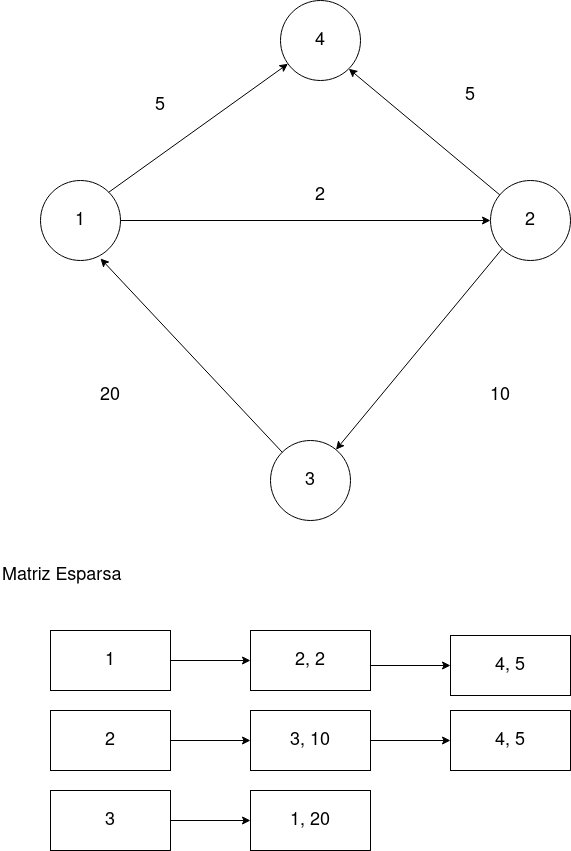

# SCC0502 Algoritmos e Estruturas de Dados 1

## Exercício 7 - Matrizes Esparsas

### Objetivo
O objetivo deste exercício prático é estimular os estudantes a se familiarizarem com o comportamento e a lógica associados à estrutura de dados **Matriz Esparsa.**

Queremos que os alunos se habituem com a implementação dessa estrutura e consigam entender as funções básicas, que garantem a execução adequada desse *TAD*, em diferentes contextos.


Para acostumar os alunos com conceitos de modularização e boas práticas de escrita de código, será exigido o uso de múltiplos arquivos _.c_ e _.h_ no projeto, bem como a construção de um
arquivo **Makefile**, responsável por gerenciar a execução do programa.

### Descrição
Podemos modelar diversos eventos corriqueiros do nosso dia a dia por meio de matrizes, desde uma planilha de custos da sua empresa até a pontuação dos seus jogadores no Cartola.
Apesar de sua eficiência e simplicidade, existem situações que a estrutura de uma matriz não se torna a ideal. Essas situações são aquelas que em existem parcelas expressivas de dados vazios dentro da nossa representação. 
Imagine ter uma matriz enorme, de dimensão 10.000 linhas por 10.000 colunas e descobrir que apenas 15% dela possui valores concretos.
Podemos visualizar se maneira imediata um desperdício de espaço e de processamento, pois operações matriciais são computacionalmente custosas.

Para exemplificar uma situação dessas, imagine que estamos mapeando as conexões entre as estações de metrô de uma cidade por meio de uma matriz.
Onde o elemento na linha X coluna Y representa a distância entre a estação X e a estação Y.

Foi percebido que uma estação dificilmente estará diretamente conectada com todas as outras,  ou seja, uma excelente oportunidade de se aplicar os conhecimentos de matrizes esparsas.

Um exemplo visual:



Numa matriz convencional:

|  | 1  |  2| 3| 4 |
|--|--|--|--|--|
| 1 | 0 | 2 | 0 | 5 |
| 2 | 0 | 0 |10 | 5 |
| 3 |20 | 0 | 0 | 0 |
| 4 | 0 | 0 | 0 | 0 |


### Entrada
Seu algoritmo deve receber como entrada um número _n_, que representa a quantidade de estações ferroviárias, e um número _c_ que presenta a quantidade de conexões existentes. Após isso serão informados as _c_ conexões existentes, no formato :
```
<estação origem> <estação destino> <distância> 
```
Se atendem aos sentidos das rotas !!!

Caso não haja rota entre duas estações, não será informada conexão.
Após todas as conexões, seu código dever ler dois valores representando a estação origem e a destino do trajeto que queremos estudar.

```
4 5
1 2 2
1 4 5
2 3 10
2 4 5
3 1 10 
1 3

```

### Saída
Como saída, seu  programa deve informar se há algum caminho possível entre _origem_ e _destino_.

```
Existe caminho.

```
Caso contrário:
```
Não existe caminho.

```


### Observações da implementação

Como é descrito na sessão objetivos desse documento, não queremos apenas que os alunos resolvam o problema, mas que utilizem
métodos que serão comuns no decorrer da disciplina.

Devido a esse objetivo, será exigido que vocês desenvolvam seu projeto representando ambas as entidades citadas na descrição como **TAD completos e fechados sobre si mesmos**, isto é, com funções auxiliares que permitam o acesso e a manipulação de seus atributos em diferentes contextos(arquivos .c separados). Os dados devem ser armazenados como um **TAD estação** (nó) e suas conexões em uma **MATRIZ ESPARSA**.

A memória deve ser alocada **dinamicamente** e ser devidamente liberada
ao fim da execução, matrizes estáticas serão desconsideradas (nota zero). 

Utilizar múltiplos arquivos _.c_ e _.h_ para separar a implementação e a responsabilidade dos métodos de cada objeto.

Construir funções para realizar  operações repetitivas, ou seja, modularizar adequadamente seu código.

Escrever um arquivo **Makefile** que será responsável por gerenciar a execução do projeto dentro da plataforma _run.codes_.


### Observações da avaliação
A avaliação do seu programa será feita além do resultado da plataforma *run.codes*. Portanto, ter um bom resultado com os casos de teste, não será suficiente para garantir a **nota máxima** e nem a **aprovação do exercício**.

Caso seu projeto não satisfaça os pontos exigidos nos **objetivos** e explicitados nas **observações de implementação**, sua nota poderá ser reduzida ou ser desconsiderada.

Cópias de código entre alunos, acusadas pela plataforma, resultarão imediatamente em **zero** aos dois ou mais alunos envolvidos.

